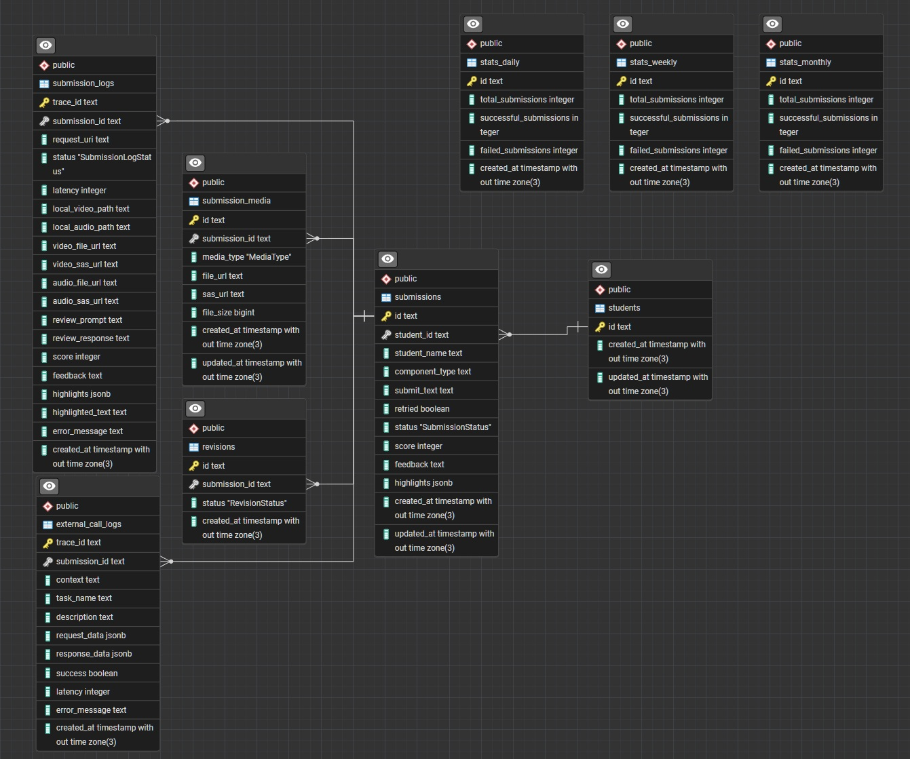

# AI Score Backend

**과제 회신으로 전달드린 .env.example 파일을 root에 위치시켜주세요**

## 실행

```bash
# 마이그레이션이 함께 진행됩니다.
docker compose --env-file .env.example up
```

## 테스트

```bash
npm run test # unit test
npm run test:cov # coverage
npm run test:integration # integration test
```

## Swagger에서 테스트를 진행하기

1. pseudo-auth/register를 호출하면 studentId와 token을 반환 받을 수 있습니다.
2. 반환 받은 token을 Authorization header에 추가하고 요청을 보내실 수 있습니다.

## ERD



## 구현 특징

### StrictReturn

StrictReturn은 로직의 성공/실패를 표현하는 타입입니다. 코드 전반에 걸쳐 사용되었으며, 이를 통해 흐름의 패턴화를 지향했습니다.

```typescript
export type StrictReturn<T = any> = Success<T> | Failure;
/**
 * process video using ffmpeg
 */
const processedVideoResult = await this.processVideo(videoPath, logContext);

if (!isSuccess(processedVideoResult)) {
  return processedVideoResult; // Type: Failure
}

/**
 * Upload video to blob storage
 */
const videoUploadResult = await this.uploadVideo(
  processedVideoResult.data.localVideoPath,
  logContext,
);

if (!isSuccess(videoUploadResult)) {
  return videoUploadResult; // Type: Failure
}
```

### Always Return

컨트롤의 분산을 피하기 위해 모든 예외는 항상 일정한 타입으로 반환 됩니다.

### Custom Decorators

명시적인 표현력과 사용성을 위한 데코레이터들을 제작했습니다.
특히, Swagger의 dynamic한 생성과 반복적 코드 지양을 위해 Pagination을 제작했습니다.

```typescript
  async getSomething(
    @Custom.Pagination(...) pagination: Pagination,
    @Custom.LogContext() logContext: LogContext,
  ) {
    ...
  }
```

### Combined Decorators

명세와 동작이 강하게 결합되어있는 use-case들을 보다 적은 코드로 처리하기 위해 제작했습니다.

```typescript
  @Combined.FileUpload({
    additionalType: ...,
  })
  @Combined.AlwaysOk({
    description: ...,
    type: ...,
  })
  async postSomething() {...}

```

### Catching Errors

반복적인 예외 처리를 회피하기 위해 헬퍼 함수(caught)와 중앙화 된 로직 진행 helper(class Processor)를 조합합했습니다. 이를 통해 예외 처리 관련한 코드를 크게 줄일 수 있었습니다.

### Always Traced

Http 컨텍스트 밖에서 일어나는 작업(Cron jobs)에 대해서도 Tracing을 지속하기 위해 traced 함수를 제작해 처리했습니다.

### Transactional

Post요청을 처리하는 service method는 Transactional하게 처리되고 있습니다.

## AI

Unit Test 작성에 AI를 적극적으로 활용했습니다.
